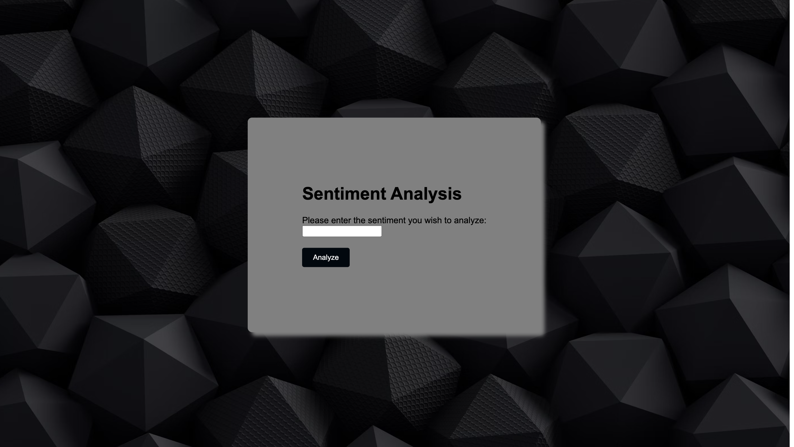

# Sentiment Analysis Web App

This project is a web application for sentiment analysis of text input. It utilizes machine learning models to analyze the sentiment of user-provided text and provides visualizations of the sentiment analysis results.

## Features

- **Sentiment Analysis:** Analyze the sentiment (positive or negative) of text input provided by the user.
- **Visualization:** Visualize the sentiment analysis results using bar charts to represent the probability of positive and negative sentiments.
- **User Interface:** Simple and intuitive user interface for easy interaction.

## Technologies Used

- **Python:** Backend development and machine learning model training.
- **Flask:** Web framework for building the backend server.
- **HTML/CSS:** Frontend development for creating the user interface.
- **JavaScript:** Client-side scripting for dynamic web elements.
- **Chart.js:** Library for creating interactive charts and visualizations.
- **Transformers Library (Hugging Face):** Used for sentiment analysis using pre-trained transformer models.
- **Git/GitHub:** Version control and project collaboration.

## Setup

1. Clone the repository: 
git clone "repository-url"
2. Install the required dependencies:
pip install -r requirements.txt
3. Run the Flask server:
python app.py

4. Access the web application in your browser at `http://localhost:5000`.

## Usage

1. Enter the text you'd like to analyze in the provided input field.
2. Click the "Analyze" button to perform sentiment analysis.
3. View the sentiment analysis result and visualization on the results page.

Below are screenshots of my projects:

